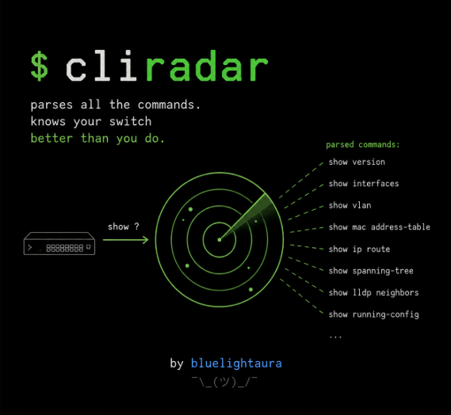

# CLIRadar



[English version](README.md)

CLIRadar — лёгкий консольный сканер CLI сетевых устройств. GUI и сервисной
обвязки нет: конфигурация хранится в YAML, документация — в обычной папке,
результат — в YAML-каталоге и небольшой автономной HTML-странице.

Инструмент не привязан к вендору и подходит для любых устройств с
Cisco-подобным CLI — интерактивной контекстной справкой `?` (Cisco IOS/NX-OS,
Huawei VRP, Eltex, QTech, КИТ и аналогичные). Новая платформа описывается
одним YAML-профилем без изменения кода.[^cli]

[^cli]: Устройства без контекстной `?`-справки (например, MikroTik RouterOS
    или оборудование, управляемое только через web/NETCONF) не поддерживаются.

Инструмент отправляет контекстный `?` без Enter и очищает строку через `Ctrl-U`.
CLIRadar не подтверждает найденные команды через Enter. Однако некоторые NOS
могут связывать побочные эффекты даже с контекстной справкой, поэтому новый тип
устройства сначала проверяется на лабораторном стенде.

## Три режима

### `docs` — каталог документации без SSH

CLIRadar разбирает `.txt`, `.md` и `.rst` из `vendor_docs/` и записывает
извлечённые команды в `output/cli_doc.yml`. Параметры устройства и пароль для
этого режима не нужны.

### `compare` — коммутатор против документации

CLIRadar сначала получает доступное дерево CLI коммутатора полным обходом от
корневого `?`. Это источник истины. Затем каждая команда из `vendor_docs/`,
не встреченная при обходе, проверяется одним контекстным запросом — без
раскрытия её ветки вглубь, поэтому синтаксические варианты из документации не
порождают лавину дополнительных запросов. Каждой строке присваивается статус:

- `matched` — команда есть на устройстве и в документации;
- `undocumented` — команда есть на устройстве, но отсутствует в документации;
- `missing_on_device` — команда описана, но отсутствует на устройстве;
- `not_observed` — отсутствие нельзя подтвердить, потому что обход не дошёл
  до нужной ветки.

Отсутствие оценивается по каждой команде отдельно, а не по одному флагу на
весь скан. Все ключевые слова узла попадают в каталог раньше, чем сработает
любое ограничение обхода, поэтому у пройденного узла список ключевых слов
полный, и отсутствующее в нём слово отсутствует на устройстве. Так `show`
получает честный `missing_on_device`, даже если где-то ниже остались
нераскрытые параметры.

### `audit` — полный аудит CLI

CLIRadar начинает с корневого `?`, обходит все доступные ветки в ширину и
помечает найденные команды как `device_status: present`. Документация в этом
режиме не читается.

Параметры вида `<1-4094>` сохраняются в YAML как шаблоны. Для числового диапазона
crawler автоматически подставляет нижнюю границу только в SSH-запрос, например:

```text
каталог: show vlan <1-4094> brief
запрос:  show vlan 1 brief ?
```

Для `WORD`, IP-адреса, имени интерфейса и других параметров добавьте рабочий
пример в `discovery.parameter_samples`. Сам плейсхолдер устройству не
отправляется.

## Быстрый старт

```bash
python -m pip install .
cp config.example.yml config.yml
```

Зависимости объявлены только в `pyproject.toml`. CLIRadar не создаёт, не
упаковывает и не коммитит виртуальное окружение.

Добавьте SSH host key коммутатора в `known_hosts`, заполните `config.yml` и
передайте пароль через переменную процесса:

```powershell
$env:SWITCH_PASSWORD = "..."
```

Проверить YAML-конфигурацию без подключения:

```bash
cliradar --config config.yml --check-config
```

Разобрать только документацию, не подключаясь к устройству:

```bash
cliradar docs --config config.yml --docs vendor_docs
```

Сравнить полное дерево устройства с документацией:

```bash
cliradar compare --config config.yml --docs vendor_docs
```

Провести полный аудит устройства без документации:

```bash
cliradar audit --config config.yml
```

Снять команды режимов конфигурации (см. «Режимы конфигурации» ниже):

```bash
cliradar audit --config config.yml --enter-modes
```

## Режимы конфигурации

Контекстная справка из режима логина показывает только команды этого режима.
Всё, что живёт внутри `configure`, VLAN-view, interface-view и подобных
контекстов, в неё не попадает. Флаг `--enter-modes` включает обход этих
контекстов, и на живом коммутаторе это даёт кратно больше команд.

Режимы **не перечислены в коде**: сканер не знает, что такое VLAN или VRF.
Правило одно — команда, после которой изменился вид приглашения, открыла новый
контекст. Так находятся и нестандартные подсистемы вендора, и режимы, о которых
никто не писал в документации.

Где сканер стоит в каждый момент, определяется не памятью, а приглашением:
`SW1(config-vlan-10)#` сворачивается в отпечаток `(config-vlan-*)#`, и этот
отпечаток проверяется перед каждым запросом справки. Если ответ пришёл не из
ожидаемого контекста, запрос не засчитывается: сканер возвращается по
записанному пути входа и повторяет его. Не помог `exit` — пробуются `quit` и
`end`, а в крайнем случае открывается новый канал, который заведомо стартует в
известном состоянии.

Что важно понимать перед запуском:

- вход в режим — это **выполнение команды**. `vlan 10` на многих платформах не
  открывает просмотр, а создаёт VLAN. Поэтому режим выключен по умолчанию;
- внутри режима Enter не нажимается: команды по-прежнему снимаются только
  контекстной справкой;
- команды, способные прервать сам обход (`reboot`, `reload`, `erase`, `write`,
  `logout`, `ping`, `terminal` и подобные), не пробуются никогда;
- не пробуется и путь управления — `line`, `username`, `aaa`, `login`, `sshd`
  и подобные. В режиме `line vty` лежат настройки аутентификации и таймаутов
  той самой линии, по которой идёт сканирование: на стенде пробы внутри него
  привели к тому, что коммутатор перестал выдавать новые сессии, и все
  найденные позже контексты стали недостижимы. Ценой отказа от одного
  контекста покупается то, что обход дойдёт до конца;
- универсальные заглушки параметров (`WORD`, `NAME`, `STRING`, `LINE`,
  `PASSWORD` и подобные) в пробах не подставляются. Конкретный плейсхолдер
  вроде `IFNAME` называет уже существующий объект, и вход в него ничего не
  меняет, а `WORD` означает «любое слово» и встречается на сотнях несвязанных
  команд: на стенде один такой пример превратил `hostname WORD` в реальное
  переименование коммутатора. Интерфейсы, VLAN и прочие объекты с
  идентификаторами при этом обходятся как обычно;
- запрос подтверждения (`[y/n]`, `[confirm]`) получает ответ «нет»: неотвеченный
  диалог съел бы все последующие нажатия;
- каждое нажатие Enter попадает в раздел `executed_commands` каталога и в
  HTML-отчёт, поэтому после прогона видно точный список изменений.

Первый прогон на новой платформе делайте на лабораторном стенде, который не
жалко сбросить.

Отдельно стоит помнить, что **проба меняет дерево, которое измеряет**. Если
проба создала `filter-list 1`, в CLI появляются команды для работы с уже
существующим ACL, и следующий прогон найдёт их. Поэтому каталоги двух прогонов
подряд не обязаны совпадать до команды, а сравнивать «до и после» имеет смысл
только на устройстве, приведённом в одинаковое состояние.

```yaml
discovery:
  enter_modes: true    # то же самое, что флаг --enter-modes
  max_contexts: 64     # предохранитель против разрастания графа
```

## Формат папки документации

Поддерживаются `.txt`, `.md` и `.rst`. Для максимально предсказуемого результата
используйте `.txt` с одной командой на строку:

```text
# комментарий
show version
show interfaces status  Состояние интерфейсов
Syntax: show vlan <1-4094>
switch# show ip route
```

В Markdown также распознаются fenced code blocks и таблицы
`| command | description |`.

В конвертированных справочниках `.txt` разбираются блоки с заголовками
`Command Format`, `Command Form`, `Command Syntax`, `Syntax`,
`Формат команды` или `Синтаксис`. Перенесённые строки синтаксиса склеиваются,
варианты `{a | b}` и необязательные группы `[optional]` раскрываются, а
окружающий текст игнорируется. Если конвертация уничтожила пробелы в заголовках,
файл пропускается, а не принимается за обычный список команд.

## Параметрические ветки

Пример конфигурации для параметров, значение которых нельзя вывести из `?`:

```yaml
discovery:
  parameter_policy: explore
  parameter_samples:
    WORD: Ethernet1/1
    A.B.C.D: 192.0.2.1
```

Одного рабочего примера обычно достаточно, поскольку структура продолжений
после параметра не зависит от конкретного VLAN или интерфейса. Если зависит,
запустите сканирование повторно с другим образцом.
Явно указанный ключ также помечает строчный токен документации, например
`interface-name`, как параметр.

## Скорость и прогресс

Во время обхода в терминал выводится живая строка прогресса:

```text
[########            ]  42% | запросов: 8214 | в очереди: 11330 | осталось: ~11м 48с
```

Процент считается от известного фронта работы, поэтому в начале обхода он
может стоять на месте, пока дерево раскрывается. Флаг `--quiet` отключает
вывод.

Обход можно ускорить параллельными shell-каналами внутри одной SSH-сессии:

```yaml
discovery:
  parallel_channels: 4
```

Каналы используются и при обходе режимов: каждый воркер сам заходит в текущий
контекст и подтверждает промптом, что дошёл, поэтому справка из разных режимов
не перемешивается.

Главный источник ускорения — не сеть, а повторы в самой грамматике CLI. На
эталонной платформе 18 000 пройденных узлов имели всего 694 разные формы:
все уровни важности логирования, все источники, все виды интерфейсов
продолжаются одинаково. Узел, форма которого (набор опций) уже встречалась,
не обходится — его поддерево копируется с уже пройденного.

Это предположение, а не факт, поэтому оно проверяется: после обхода выборка
выведенных узлов переспрашивается у устройства, и узел, ответивший иначе,
попадает в `derived_mismatched`, а обход помечается неполным. Копии
подчиняются `max_depth`, а упор в `max_derived_entries` сообщается, а не
обрезает каталог молча.

```yaml
discovery:
  deduplicate_subtrees: true   # выключается, если нужен буквальный обход
  verify_samples: 25           # сколько выведенных узлов перепроверить
```

Дедупликации нужен один детерминированный порядок обхода, поэтому вместе с
`parallel_channels` она не работает: при нескольких каналах обход идёт
буквально. Выбирать почти не приходится — один канал с дедупликацией на
стенде оказался быстрее четырёх без неё.

Отдельно про задержку: CLI после ответа на `?` перерисовывает строку —
печатает приглашение и заново набранный префикс. Это детерминированный признак
конца ответа, поэтому сканер не ждёт паузы в выводе, а читает ровно до него.
На стенде это дало 20 запросов в секунду на канал вместо 3 (медиана 37 мс
вместо 320 мс). Платформы, которые строку не перерисовывают, тихо работают
по-старому — через `device.idle_timeout`.

Устройства с малым лимитом vty молча получают меньше каналов — сканер
продолжает работу с тем количеством, которое железка разрешила. Также на
скорость влияют `device.read_timeout` и `device.idle_timeout`: чем они меньше,
тем быстрее обход, но на медленных устройствах ответы могут обрезаться.

## Версия ПО в отчёте

Набор команд имеет смысл только рядом с прошивкой, которая его отдала, поэтому
перед обходом CLIRadar выполняет команды из `discovery.version_commands` (только
чтение) и записывает их вывод в каталог и в начало HTML-отчёта. Два каталога
можно сравнивать лишь тогда, когда видно, что они сняты с одной прошивки.

```yaml
discovery:
  version_commands:
    - show version      # на CLI в стиле VRP — 'display version'
```

По умолчанию — `show version`. Вендоры расходятся в названии команды, поэтому
устройство, которое её не понимает, даёт отчёт без штампа, а не сорванный скан;
команда, способная изменить устройство, отклоняется при загрузке конфигурации.
Пустой список отключает штамп — тогда Enter нажимается только при `--enter-modes`.

Снятый текст очищается перед сохранением: эхо команды и приглашение убираются,
строки с hostname, серийным номером, system-id и MAC маскируются — каталог
обещает `identity: redacted`. Строки с секретами (`password`, `secret`,
`community`, `key`, …) удаляются целиком, поэтому даже `show running-config`
не утащит пароли в отчёт, которым вы делитесь. Это страховка, а не гарантия:
на незнакомой платформе просмотрите штамп перед публикацией отчёта.

## Результат

По умолчанию режимы записывают:

- `docs` → `output/cli_doc.yml`;
- `audit` → `output/cli_real.yml`;
- `compare` → `output/cli_compare.yml`.

Формат каталога:

```yaml
schema_version: 3
mode: compare
device:
  identity: redacted
  firmware:
    captured_at_start: true
    results:
      - command: show version
        output: |-
          SwitchOS Software, Version 8.4.2
scan:
  complete: true
  queries: 1254
summary:
  device_commands: 4830
  documentation_commands: 4700
  matched: 4650
  undocumented: 180
  missing_on_device: 50
commands:
  - command: show version
    description: Displays software version
    executable: true
    source:
      - cli
      - documentation:vendor_docs/commands.txt
    comparison_status: matched
```

Режим `compare` дополнительно создаёт `output/missing_commands.html`. Страница
показывает команды со статусом `missing_on_device`. Если обход неполный, она
выводит `not_observed` с предупреждением и не утверждает, что этих команд точно
нет. Путь настраивается через `output.html_report`.

Каждый режим также записывает две дополнительные выгрузки:

- `output/commands_tree.yml` — вложенное дерево токенов (ключ узла =
  добавляемое слово, лист пуст);
- `output/commands_human.yml` — плоский список «команда: что она делает»,
  отсортированный по алфавиту.

В режимах `compare` и `audit` в выгрузки попадают команды, реально увиденные
на устройстве; в режиме `docs` — команды из документации. Пути настраиваются
через `output.tree_catalog` и `output.human_catalog`.

Необработанные ответы можно включить через `output.raw_log`; по умолчанию журнал
выключен. В POSIX каталог, HTML-отчёт и журнал создаются с режимом `0600`; в
Windows используются ACL родительского каталога.

## Границы и безопасность

- Используйте только устройства, на аудит которых у вас есть разрешение.
- Сначала проверяйте профиль на лабораторном коммутаторе и read-only учётной
  записи.
- Неизвестные SSH host keys отклоняются; устаревший `ssh-rsa` отключён.
- Пароль читается из переменной процесса и не попадает в YAML-каталог и raw log.
- CLIRadar исследует только текущий CLI-контекст. Он не нажимает Enter для входа
  в configuration submode.
- Контекстный `?` не гарантированно безопасен на всех NOS: отдельные реализации
  могут создавать значения по умолчанию или менять состояние даже при выводе
  справки. Новый тип устройства сначала проверяйте на стенде с учётной записью
  только для чтения, а рискованные ветки добавляйте в `denied_tokens`.
- Полнота зависит от реализации `?`, пагинации, прав учётной записи, лимитов и
  примеров для параметров.
- Поле `scan.complete` показывает, можно ли считать отсутствие команды
  подтверждённым. При неполном обходе используется `not_observed`, а не
  `missing_on_device`.
- `denied_tokens` исключает ветки из раскрытия; список следует подбирать по
  результатам проверки конкретной платформы на стенде.

## Проверки проекта

```bash
ruff check .
pytest
bandit -q -r src
pip-audit
```

Архитектура: [docs/ARCHITECTURE_RU.md](docs/ARCHITECTURE_RU.md). Эксплуатация:
[docs/OPERATIONS_RU.md](docs/OPERATIONS_RU.md).
